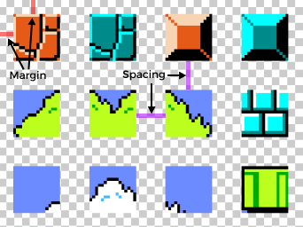

# Tile Extruder

A tiny Node CLI (and library) to extrude tiles in tilesets to avoid bleeding issues.


You can read more about the bleeding problem and solution [~~here~~](http://rotorz.com/unity/tile-system/docs/edge-correction) (note: rotorz site is down as of 12/27/18, you can try this [archived version of the page](https://web.archive.org/web/20180411151113/http://rotorz.com/unity/tile-system/docs/edge-correction) until the site is restored). This CLI app handles both tilesets with and without margin & spacing.

Interested in learning more about how to use tilemaps in Phaser 3? Check out my [blog post series](https://medium.com/@michaelwesthadley/modular-game-worlds-in-phaser-3-tilemaps-1-958fc7e6bbd6) about building modular worlds with tilemaps. It explains the concept of a tilemap, and of course, it uses extruded tiles 😉.

- [Tile Extruder](#tile-extruder)
  - [Usage](#usage)
    - [Usage as a Command Line Tool](#usage-as-a-command-line-tool)
    - [Usage as a Library](#usage-as-a-library)
    - [Using the Extruded Tileset](#using-the-extruded-tileset)
  - [Tileset Credits](#tileset-credits)
  - [Changelog](#changelog)

## Usage

There are two ways to use the tool to extrude a tileset image. If you just need to extrude some tilesets, you can use it as a command line tool. If you need to do something that requires more control (like integrating tile-extruder into build pipeline), you can use it as a JS library.

### Usage as a Command Line Tool

Make sure you have [node](https://nodejs.org/en/) installed and then run:

```
npm install --global tile-extruder
```

(Or, you can run tile-extruder directly without globally installing in npm 5.2 and greater via `npx tile-extruder`!)

Once you've got it installed, open a terminal and run a command with the following arguments:

```
tile-extruder [args]
```

An example usage for a 8 x 16 tile size tileset with no margin or spacing:

```
tile-extruder --tileWidth 8 --tileHeight 16 --input ./tilesets/borders-tileset.png --output ./tilesets/borders-tileset-extruded.png
```

An example usage for a 16 x 16 tile size tileset with 5px margin and 10px spacing:

```
tile-extruder --tileWidth 16 --tileHeight 16 --margin 5 --spacing 10 --input ./tilesets/mario-tileset.png --output ./tilesets/mario-tileset-extruded.png
```

Additional usage information:

```
A small CLI to extrude tiles. Use --help for more information.

Options:

  -V, --version                 output the version number
  -w, --tileWidth <integer>     tile width in pixels
  -h, --tileHeight <integer>    tile height in pixels
  -i, --input <path>            the path to the tileset you want to extrude
  -o, --output <path>           the path to output the extruded tileset image    
  -c, --color [hex=0xffffff00]  RGBA color to use for the background color, only matters if there is margin or spacing (default: transparent white)
  -m, --margin [integer=0]      number of pixels between tiles and the edge of the tileset image (default: 0)
  -s, --spacing [integer=0]     number of pixels between neighboring tiles (default: 0)
  -e, --extrusion [integer=1]   number of pixels to extrude by (default: 1)
  -h, --help                    output usage information
```

A note on terminology, _spacing_ is the number of pixels between neighboring tiles, while _margin_ is the number of pixels between the edges of the image and the tiles. Or, more visually explained:



### Usage as a Library

If you're reading this on npm/GitHub, you can read the documentation online [here](https://sporadic-labs.github.io/tile-extruder) which includes API documentation. Also, see [node examples](https://github.com/sporadic-labs/tile-extruder/tree/master/examples/node) folder for code.

Install the library as a dependency in your Node project:

```
npm install tile-extruder
```

This exposes three utility functions, which all extrude a given tileset image, but differ in terms of their output.

```js
const {
  extrudeTilesetToImage, // Saves an image to disk
  extrudeTilesetToBuffer, // Returns image in a Buffer (compatible with libraries like imagemin)
  extrudeTilesetToJimp // Returns the underlying Jimp image object
} = require("tile-extruder");
```

To save an extruded tileset to disk:

```js
const { extrudeTilesetToImage } = require("tile-extruder");

async function main() {
  await extrudeTilesetToImage(16, 16, "./buch-tileset.png", "./buch-tileset-extruded.png");
}

main();
```

To obtain the extruded tileset as a [Buffer](https://nodejs.org/api/buffer.html) and then minify it before saving using [imagemin](https://github.com/imagemin/imagemin):

```js
const { extrudeTilesetToBuffer } = require("tile-extruder");
const imagemin = require("imagemin");
const imageminPngquant = require("imagemin-pngquant");
const fs = require("fs");

async function main() {
  const buffer = await extrudeTilesetToBuffer(16, 16, "./buch-tileset.png");
  const minifiedBuffer = await imagemin.buffer(buffer, {
    plugins: [
      imageminPngquant({
        quality: [0.6, 0.8] // See https://github.com/imagemin/imagemin-pngquant
      })
    ]
  });
  fs.writeFileSync("./buch-tileset-extruded-minified.png", minifiedBuffer);
}

main();
```

### Using the Extruded Tileset

This tool was built for a Phaser & Tiled project, so here's how to integrate with that pipeline.

If you've already built a map in Tiled with a non-extruded tileset and are looking to replace it with an extruded tileset, you've got a couple options:

* Extrude the tileset and then update your existing tileset in Tiled. In the "Tilesets" panel, click on the edit tileset icon (the wrench) and then click on "Tileset Properties" under the Tileset menu bar item. Edit the "Image" field, replacing the tileset image with the new extruded image and updating to the margin and spacing.
* If you'd rather leave your Tiled file alone, you can just adjust things on the Phaser side. See this [example](https://github.com/sporadic-labs/tile-extruder/blob/master/examples/phaser/main.js). You want to load the extruded tileset image, and then when you create your tileset, specify the appropriate margin and spacing:

```js
// Parameters: name in Tiled, phaser cache key, tile width, tile height, margin, spacing
const tileset = map.addTilesetImage("tileset", "tileset-extruded", 48, 48, 1, 2);
```

Note: you'll have to adjust your margin & spacing because of the extrusion. If you had no margin & spacing, then the new margin is 1px and the spacing is 2px.

## Tileset Credits

* Dungeon Tileset by Buch - [Source](https://opengameart.org/content/top-down-dungeon-tileset)
* Minirouge Tileset by Arachne - [Source](https://forums.tigsource.com/index.php?topic=14166.0)
* Mario Tileset - [Source](http://rmrk.net/index.php?topic=37002.0)

## Changelog

* 2.0.3
  * Fix for #8. Jimp's blit started using alpha-blending, which caused incorrect tile extrusions if a tile had any non-opaque pixels, thanks [@FranciscoCaetano88](https://github.com/FranciscoCaetano88). 
  * Changed default background color from transparent black to transparent white.
* 2.0.2
  * Updated dependencies.
* 2.0.1
  * Fixed broken deploy (missing needed files) for v2.0.0.
* 2.0.0
  * Restructure to export three methods - `extrudeTilesetToImage`, `extrudeTilesetToBuffer`,`extrudeTilesetToJimp` - to make it easier to integrate the library into other tools like [create-phaser-app](https://github.com/simiancraft/create-phaser-app/).
* 1.2.0
  * Update jimp dependency to latest (0.6.4)
  * Make underlying library return a promise (to address [#6](https://github.com/sporadic-labs/tile-extruder/issues/6), thanks [@the-simian](https://github.com/the-simian))
  * Cleaner error handling
