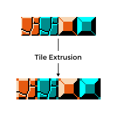

# Tile Extruder

A tiny Node app to extrude tiles in tilesets to avoid bleeding issues.




You can read more about the bleeding problem and solution [~~here~~](http://rotorz.com/unity/tile-system/docs/edge-correction) (note: rotorz site is down as of 12/27/18, you can try this [archived version of the page](https://web.archive.org/web/20180411151113/http://rotorz.com/unity/tile-system/docs/edge-correction) until the site is restored). This CLI app handles both tilesets with and without margin & spacing.

Interested in learning more about how to use tilemaps in Phaser 3? Check out my [blog post series](https://medium.com/@michaelwesthadley/modular-game-worlds-in-phaser-3-tilemaps-1-958fc7e6bbd6) about building modular worlds with tilemaps. It explains the concept of a tilemap, and of course, it uses extruded tiles 😉.

## Installation

Make sure you have [node](https://nodejs.org/en/) and npm installed:

```
npm install --global tile-extruder
```

(Or, you can run tile-extruder directly without globally installing in npm 5.2 and greater via `npx tile-extruder`.)

## Usage

Open a terminal in the folder and run a command with the following arguments:

```
tile-extruder [args]
```

An example usage for a 8 x 16 tile size tileset with no margin or spacing:

```
tile-extruder --tileWidth 8 --tileHeight 16 --input ./tilesets/borders-tileset.png --output ./tilesets/borders-tileset-extruded.png
```

An example usage for a 16 x 16 tile size tileset with 5px margin and 10px spacing:

```
tile-extruder --tileWidth 16 --tileHeight 16 --margin 5 --spacing 10 --input ./tilesets/mario-tileset.png --output ./tilesets/mario-tileset-extruded.png
```

Additional usage information:

```
A small CLI to extrude tiles. Use --help for more information.

Options:

  -V, --version                 output the version number
  -w, --tileWidth <integer>     tile width in pixels
  -h, --tileHeight <integer>    tile height in pixels
  -i, --input <path>            the path to the tileset you want to extrude
  -o, --output <path>           the path to output the extruded tileset image
  -c, --color [hex=0x00000000]  RGBA hex color to use for the background color, only matters if there's margin                                or spacing (default: transparent)
  -m, --margin [integer=0]      number of pixels between tiles and the edge of the tileset image (default: 0)
  -s, --spacing [integer=0]     number of pixels between neighboring tiles (default: 0)
  -h, --help                    output usage information
```

## Terminology

_Spacing_ is the number of pixels between neighboring tiles. _Margin_ is the number of pixels between the edges of the image and the tiles. Or, more visually explained:


## Using the Extruded Tileset

This tool was built for a Phaser & Tiled project, so here's how to integrate with that pipeline.

If you've already built a map in Tiled with a non-extruded tileset and are looking to replace it with an extruded tileset, you've got a couple options:

* Extrude the tileset and then update your existing tileset in Tiled. In the "Tilesets" panel, click on the edit tileset icon (the wrench) and then click on "Tileset Properties" under the Tileset menu bar item. Edit the "Image" field, replacing the tileset image with the new extruded image and updating to the margin and spacing.
* If you'd rather leave your Tiled file alone, you can just adjust things on the Phaser side. See this [example](https://github.com/sporadic-labs/tile-extruder/blob/master/phaser-test/main.js). You want to load the extruded tileset image, and then when you create your tileset, specify the appropriate margin and spacing:

```js
// Parameters: name in Tiled, phaser cache key, tile width, tile height, margin, spacing
const tileset = map.addTilesetImage("tileset", "tileset-extruded", 48, 48, 1, 2);
```

Note: you'll have to adjust your margin & spacing because of the extrusion. If you had no margin & spacing, then the new margin is 1px and the spacing is 2px.

## Tileset Sources

* Dungeon Tileset by Buch - [Source](https://opengameart.org/content/top-down-dungeon-tileset)
* Minirouge Tileset by Arachne - [Source](https://forums.tigsource.com/index.php?topic=14166.0)
* Mario Tileset - [Source](http://rmrk.net/index.php?topic=37002.0)

## Changelog

- 1.2.0
  - Update jimp dependency to latest (0.6.4)
  - Make underlying library return a promise (to address [#6](https://github.com/sporadic-labs/tile-extruder/issues/6), thanks [@the-simian](https://github.com/the-simian))
  - Cleaner error handling